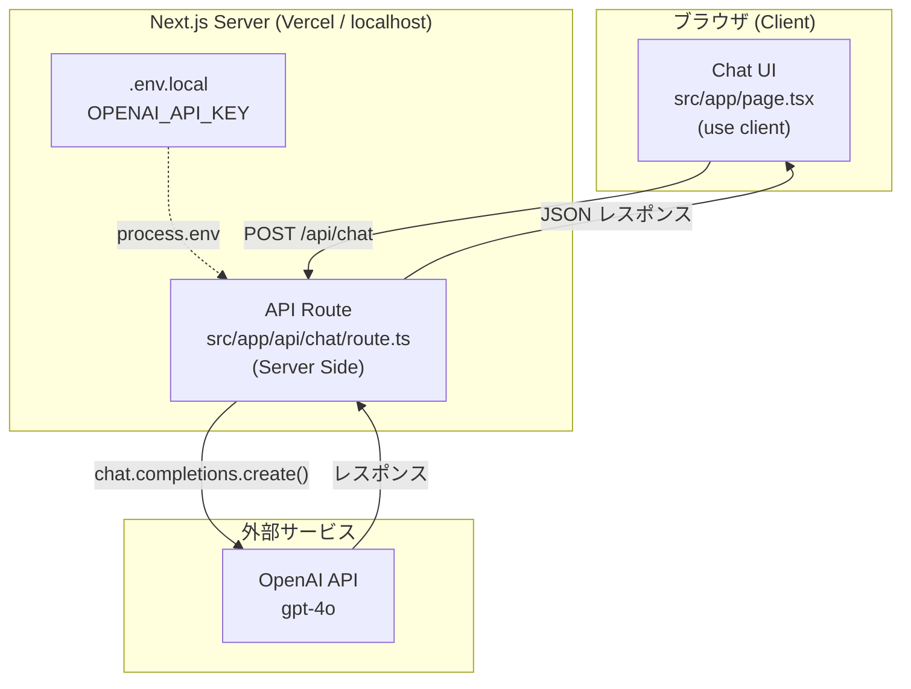
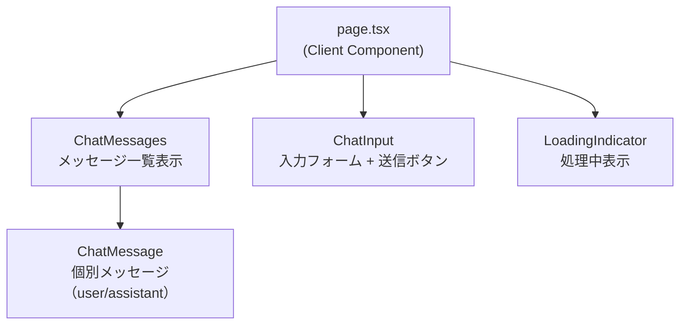

# アーキテクチャ図 - chat_app

> CCAGI SDK Phase 2: Design
> 生成日: 2026-03-12

---

## システム全体アーキテクチャ



---

## ディレクトリ構成

```
chat_app/
├── src/
│   ├── app/
│   │   ├── page.tsx              # チャットUI（Client Component）
│   │   ├── layout.tsx            # ルートレイアウト
│   │   └── api/
│   │       └── chat/
│   │           └── route.ts      # OpenAI API呼び出し（Server）
│   ├── components/
│   │   ├── ChatMessage.tsx        # メッセージ表示コンポーネント
│   │   ├── ChatInput.tsx          # 入力フォームコンポーネント
│   │   └── LoadingIndicator.tsx   # ローディング表示
│   └── types/
│       └── chat.ts               # 型定義（Message等）
├── docs/                         # CCAGI生成ドキュメント
├── .env.local                    # OPENAI_API_KEY
├── next.config.ts
├── tailwind.config.ts
└── tsconfig.json
```

---

## コンポーネント構成



---

## 技術スタック

| レイヤー | 技術 | 役割 |
|---------|------|------|
| Frontend | Next.js 15 (App Router) | UIフレームワーク |
| Styling | Tailwind CSS | スタイリング |
| Language | TypeScript (strict) | 型安全な開発 |
| API Layer | Next.js API Routes | サーバーサイドAPI |
| AI | OpenAI gpt-4o | チャット応答生成 |
| Hosting | Vercel (検証用) | デプロイ |

---

*🤖 Generated by CCAGI SDK v3.13.0 - Phase 2: Design (CMD-004)*
