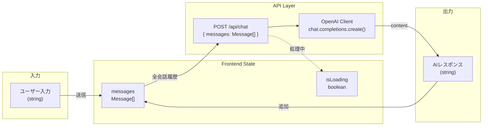
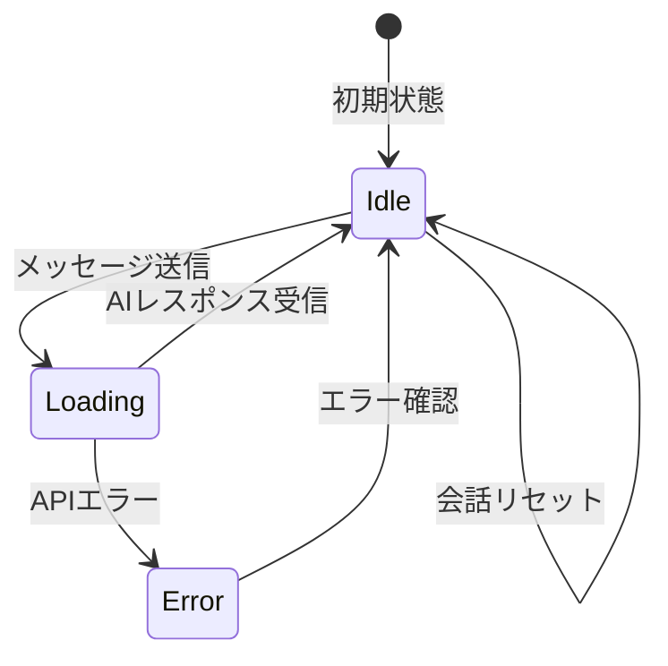

# データフロー図 - chat_app

> CCAGI SDK Phase 2: Design
> 生成日: 2026-03-12

---

## メッセージデータフロー



---

## データ型定義

```typescript
// src/types/chat.ts

type Role = "user" | "assistant";

interface Message {
  id: string;          // ユニークID（crypto.randomUUID()）
  role: Role;          // 送信者
  content: string;     // メッセージ本文
  createdAt: Date;     // 作成日時
}

// API リクエスト
interface ChatRequest {
  messages: Pick<Message, "role" | "content">[];
}

// API レスポンス
interface ChatResponse {
  message: string;     // AIの返答テキスト
}
```

---

## 状態管理フロー



---

*🤖 Generated by CCAGI SDK v3.13.0 - Phase 2: Design (CMD-005)*
