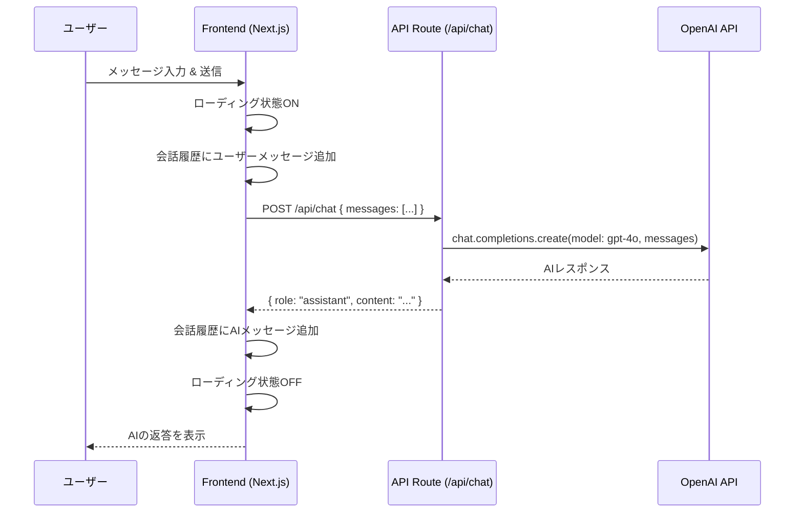
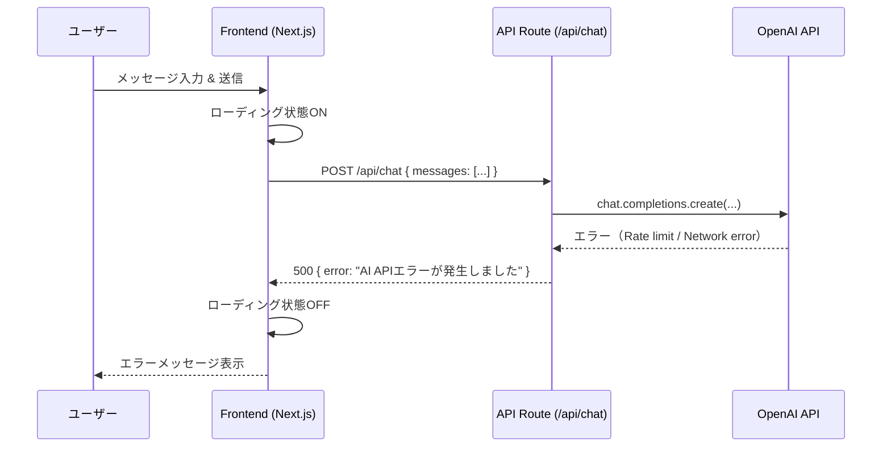
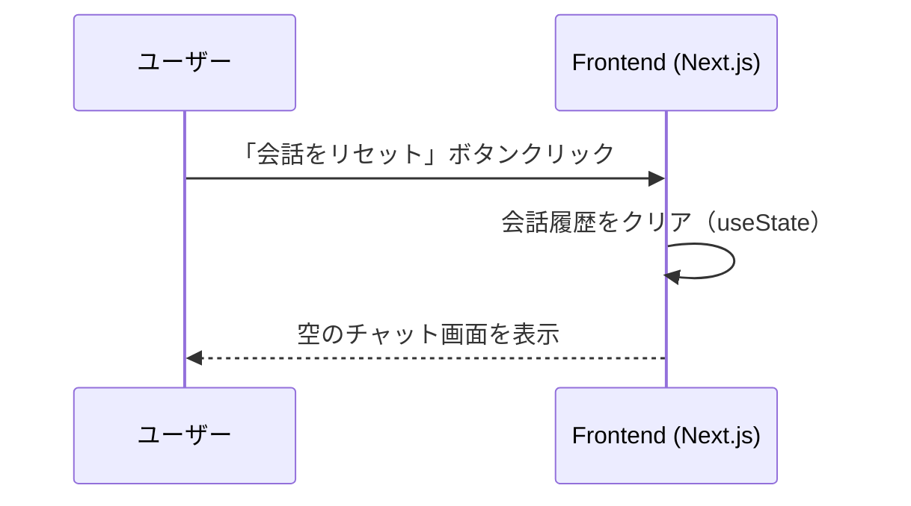

# シーケンス図 - chat_app

> CCAGI SDK Phase 2: Design
> 生成日: 2026-03-12

---

## SD-001: メッセージ送信フロー（正常系）

### 関連要件
- FR-001: チャット機能（コア）
- FR-004: ローディング・エラー表示

---

## SD-002: メッセージ送信フロー（エラー系）

### 関連要件
- FR-004: ローディング・エラー表示

---

## SD-003: 会話リセットフロー

### 関連要件
- FR-002: チャット履歴管理

---

*🤖 Generated by CCAGI SDK v3.13.0 - Phase 2: Design (CMD-003)*
